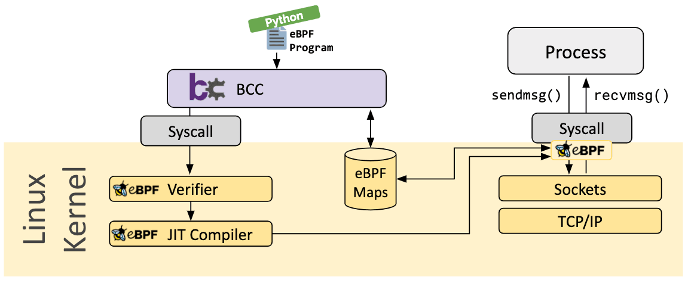

<div align="center">


</div>

# Observer

Observer is a system call tracer leveraging eBPF technology to execute programs within the kernel.

This project uses BCC as the toolkit, which provides a frontend to create valid BPF programs while maintaining flexibility, making development easier and more efficient.

For translating system call IDs to their designations, we use a syscall table for the x86_64 architecture. Ensure you use the correct syscall table for your system architecture.

## Implemented Features

- [x] Trace all system calls made by all processes.
- [x] Trace all system calls made by a specific process.
- [x] Trace a specific system call made by a specific process.
- [ ] Trace a specific system call made by all processes.
- [ ] GUI interface for visualization.

## eBPF (Extended Berkeley Packet Filter)

<div align="center">


</div>

eBPF is a event-driven, Linux kernel technology that allow to run sandboxed programs in a privileged context, extending kernel capabilities without modifying source code or loading kernel modules. 

It enables efficient kernel-space code execution, bypassing system call overhead, and allows customization of kernel-space operations.

### Kernel Capabilities

In this project, we leverage the eBPF virtual machine (VM) for Just-In-Time (JIT) compilation of eBPF bytecode into native machine code directly within the kernel.

We also utilize static tracepoints provided by the kernel to capture  all system calls. When we want to capture a single syscall we use dynamic hooks, kprobes(kernel probes).

Additionally, the project makes use of the eBPF verifier and eBPF maps for enhanced functionality and data handling.

#### Maps

eBPF maps store and exchange information between kernel and user space. They can be accessed by eBPF programs and user-space applications via system calls.

This project uses:
- **Ring Buffers**: For output.
- **Arrays**: For input, storing configuration modes, and enabling the eBPF program to choose operation modes.

### BCC (BPF Compiler Collection)

BCC is a framework enabling Python programs with embedded eBPF programs.

<div align="center">



</div>

## Installation

Ensure the required dependencies are installed:

```bash
sudo apt update
sudo apt install bpfcc-tools linux-headers-$(uname -r)
```

Install Python:

```bash
sudo apt install python3 python3-pip
```

For additional installation help, refer to the [BCC installation guide](https://github.com/iovisor/bcc/blob/master/INSTALL.md).

## How to Run

Specify one or no process IDs (PIDs) to trace system calls. If no PID is provided, the script traces system calls for all processes. 

You can also specify one or no syscall names to trace.

```bash
python3 observer.py -p <PID1> -s <syscallName>
```

## References

- [eBPF Website](https://ebpf.io/)
- [eBPF Documentation](https://docs.ebpf.io/linux/)
- [BCC Documentation](https://github.com/iovisor/bcc/blob/master/docs/reference_guide.md)
- [Syscall Table for x86_64](https://github.com/torvalds/linux/blob/v6.10/arch/x86/entry/syscalls/syscall_64.tbl#L11)
- [IBM Article](https://www.ibm.com/think/topics/ebpf)
